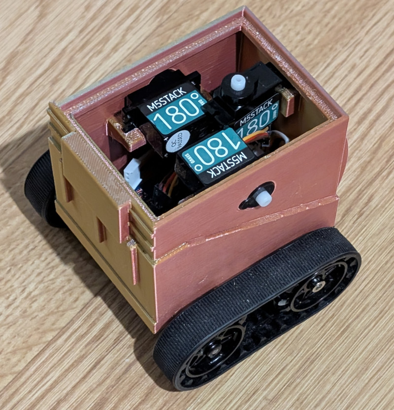
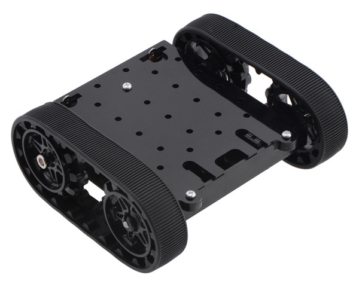
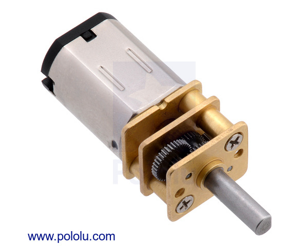
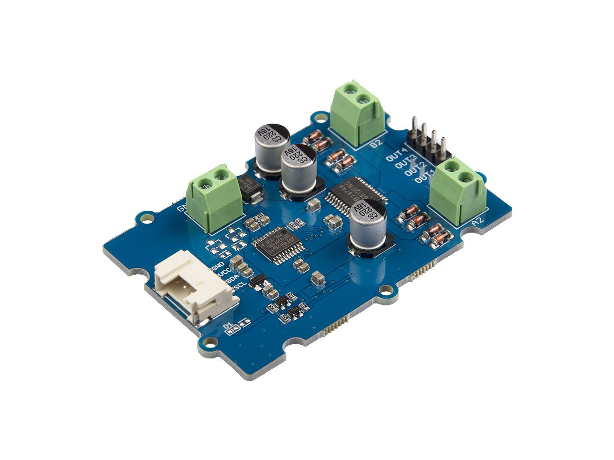
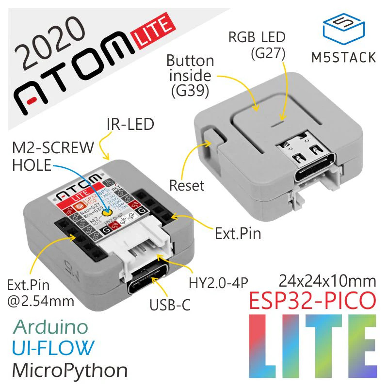
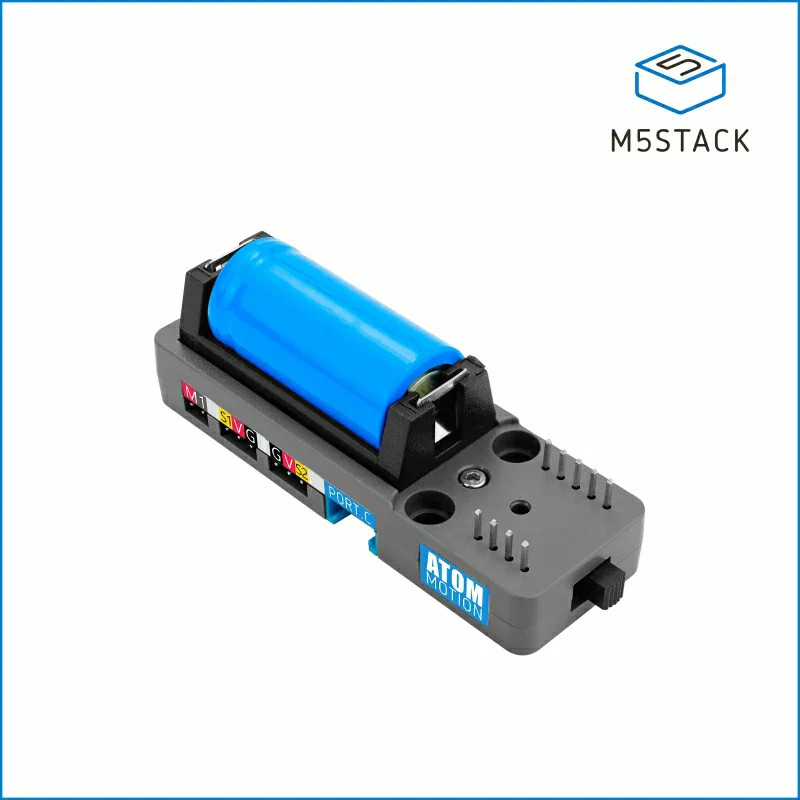
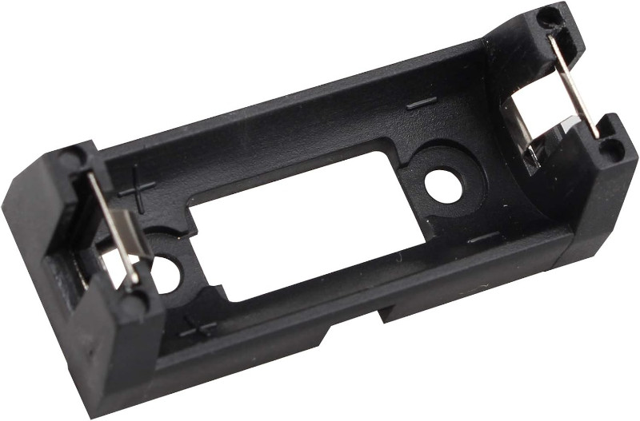
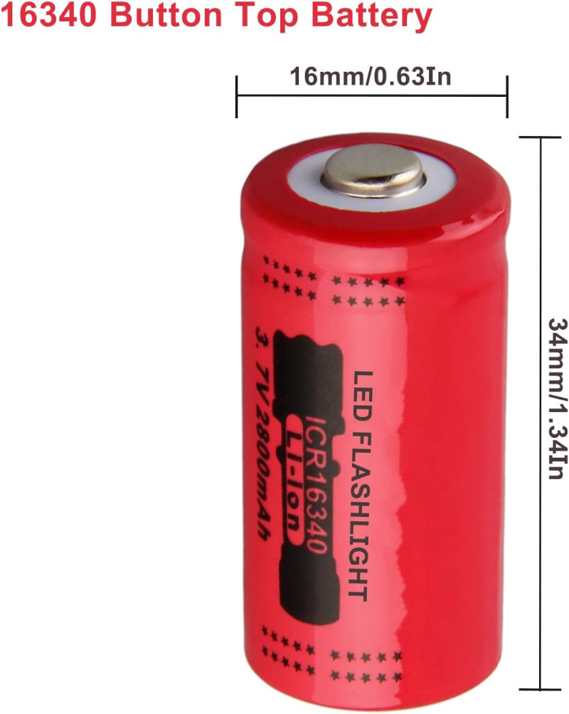
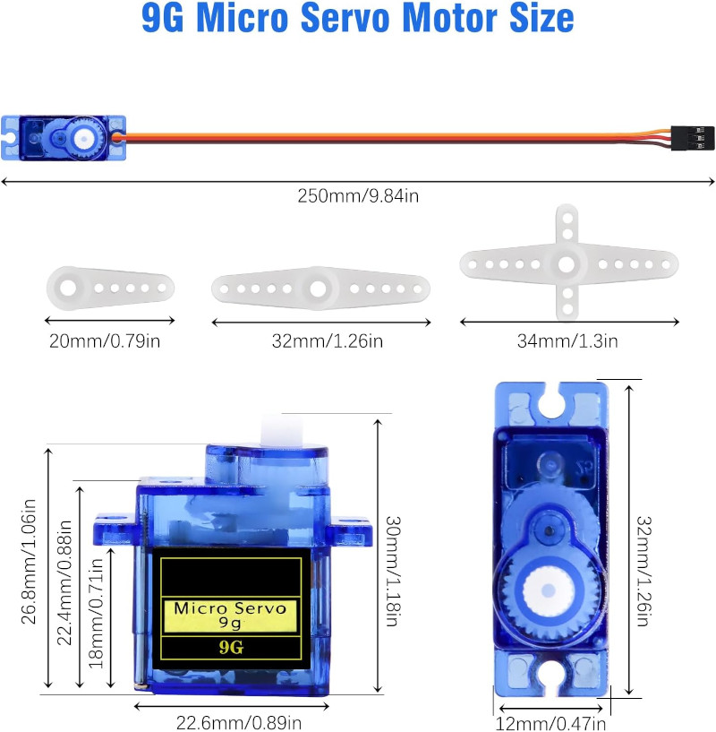
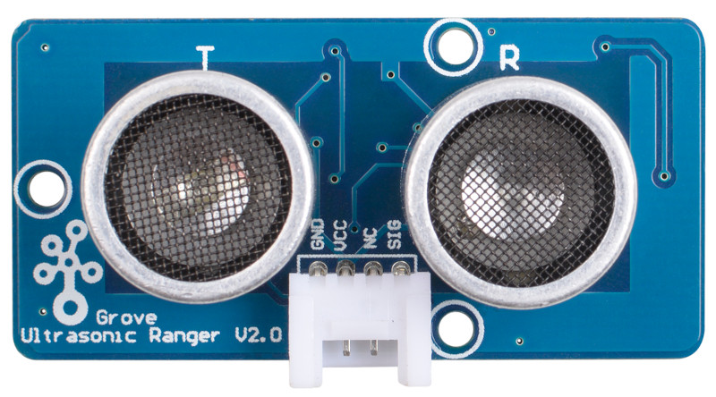

# M5Atom Wall-E

Create your Wall-E thanks to M5atom

## Hardware
- [1x Zumo Chassis Kit](https://www.pololu.com/product/1418) 
- [2x Micro Metal Gearmotor HP 6V](https://www.pololu.com/product/1101) 
- [Grove - I2C Motor Driver](https://www.seeedstudio.com/Grove-I2C-Motor-Driver-TB6612FNG-p-3220.html) 
- [M5Atom](https://shop.m5stack.com/products/atomic-motion-base-stm32f030?variant=44393917219073) 
- [Atomic Motion Base](https://shop.m5stack.com/products/atom-tailbat) 
- [Battery 16340 2600mAh](https://www.amazon.fr/Rechargeables-Batterie-2800mAh-Capacit%C3%A9-Frontale/dp/B0CTQ4X244)
- [Battery holder for 16340](https://www.amazon.fr/dp/B07MC7WR8J?ref=ppx_yo2ov_dt_b_fed_asin_title)
- [3x ServoMotors sg90](https://www.amazon.fr/dp/B0DFCGXY2J)
- [Grove Ultrasonic distance sensor](https://www.seeedstudio.com/Grove-Ultrasonic-Distance-Sensor.html)
- [A bluetooth gamepad supported by BluePad32 for Arduino](https://gitlab.com/ricardoquesada/bluepad32-arduino) 

## Software
